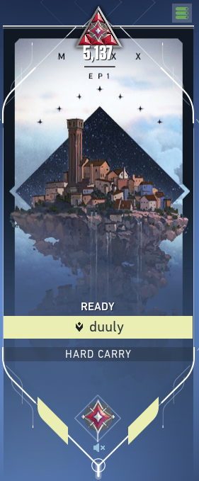

<h1> Indubitably! I'm a software dev - how could I not play video games during my free time? </h1>
I have not played in a while because I a am spending the majority of my time learning about programming, but during my peak performance I primarily played League of Legends and Valorant.

<h3> League of Legends: </h3>
   <ul>
<li> <a href="https://www.op.gg/summoners/na/duuly" target="_blank">duuly</a> </li>
<li> <a href="https://www.op.gg/summoners/na/cute+toxic+boy" target="_blank">Cute toxic Boy</a> </li>
<li> <a href="https://na.op.gg/summoners/na/pma%20till%2015" target="_blank">PMA Till 15</a> </li>
<li> <a href="https://www.op.gg/summoners/na/TONKATRUCK69" target="_blank">TONKATRUCK69</a> </li>
   </ul>
   
<h3> Valorant: </h3>
   <ul>
<li> <a href="https://tracker.gg/valorant/profile/riot/duuly%23JINKI/overview" target="_blank">duuly</a> </li>
<li> <a href="https://tracker.gg/valorant/profile/riot/DUULY%20%E3%83%84%23JINKI/overview" target="_blank">DUULYツ</a> </li>
<li> <a href="https://tracker.gg/valorant/profile/riot/west%20korean%23nuke/overview" target="_blank">west korean</a> </li>
   </ul>
 

<a href="https://jinki-lee.github.io/blog/" target="_blank">Click me to return back to blog page.</a>

